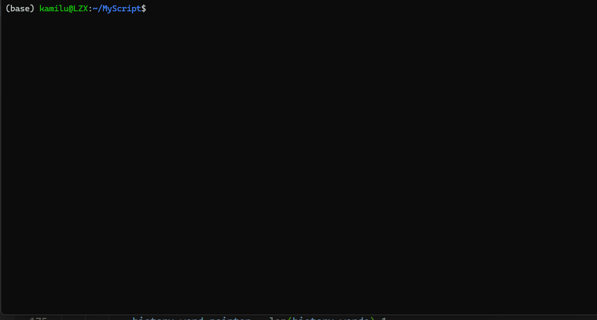

# MyScript


MyScript is a Python script for auto environment setup

Type what you want, `MyScript` will save your time for searching:

- how to install
- where to find offical document

## Introduction [Bilibili](https://www.bilibili.com/video/BV1qe4y147Xj/)



## Usage (Linux Only)

### Requirement

```bash
pip install rich
```

### Run

```bash
python main.py
```

### Keyboard Use

<kbd>enter</kbd> for step in

<kbd>Esc</kbd> for step back

in SELECT MODE you could use <kbd>left</kbd> or <kbd>right</kbd> to choose

in DISPLAY MODE you could use <kbd>Tab</kbd> to move, and use <kbd>left</kbd> or <kbd>right</kbd> to change example

### Other options

- Set global

  ```bash
  python main.py -e
  source ~/.bashrc
  ```

  Then you could use `msg` to run this program in everywhere

- Add new script

  ```bash
  msp -a
  ```

## Support


## Contribution

Hope for your contribution and expecially thanks for your contribution!

### Contribute for information

- fork this repo
- create a json file under `./scripts`
- finsh your json
- create a new pull request

## Develop Reference

- [non-block keyboardmap](https://github.com/luzhixing12345/keyboardmap)
- [rich](https://github.com/Textualize/rich)